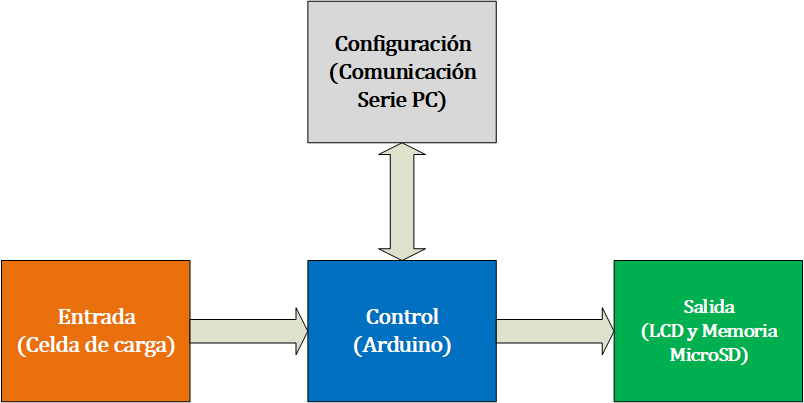

# 
**Monitor de Motor en Arduino**

## Content

1. [Visión general](#Overview)
2. [Hardware utilizado.](#Hardware)
3. [Conexiones.](#Conections)
4. [Código](#Code)

## **Visión general** 

Este sistema sensa la fuerza de empuje de un motor y, al ingresar manualmente sus revoluciones por minuto, calcula el torque y la potencia del mismo. Los valores obtenidos se despliegan en una pantalla LCD y se guardan en un archivo csv en una tarjeta micro SD para su posterior análisis.

El sistema se encuentra dividido a su vez en 4 etapas:
- Etapa de entrada.
- Etapa de control.
- Etapa de salida.
- Etapa de configuración.

  
*Figura 1 – Diagrama por bloques*

La etapa de estrada está conformada por la celda de carga y el módulo amplificador HX711. La celda de carga es una estructura diseñada para soportar cargas de compresión, en cuyo interior se encuentran varios sensores de deformación llamados Galgas extensiométricas. Estos sensores cambian el valor de su resistencia en función de su deformación, en este caso causada por una fuerza de compresión. Al aplicarle un voltaje de entrada genera un voltaje de salida proporcional a la fuerza aplicada, sin embargo, estos incrementos son en orden de milivolts, por lo que es necesario usar un amplificador de voltaje HX711 el cual convierte la entrada analogica en digital y lo envía por medio de un bus serie al subsistema de control.

La etapa de salida consta de tres módulos. Un adaptador MicroSD para el almacenamiento de los datos, un módulo interfaz de conversión I2C a LCD y un módulo display LCD de 20 caracteres por 4 líneas para desplegar los valores de los datos en tiempo real. En el caso del módulo MicroSD se comunica con el Arduino por medio del bus SPI. Por otra parte el módulo LCD está conectado directamente a la interfaz de conversión que a su vez se comunica con el Arduino por medio del bus I2C.

En la etapa de Configuración es necesario comunicar al Arduino con un monitor Serie en una computadora, el cual se conecta a través del cable USB. Para fines prácticos, se puede ocupar el monitor serie integrado en el IDE de Arduino. Por medio de este monitor se interactúa con el usuario para llevar a cabo la calibración de la celda de carga o para ajustar el valor de las RPM.

Para el caso de la Etapa de Control se cuenta con una tarjeta Arduino UNO, la cual realiza la calibración de la celda de carga y periódicamente lleva a cabo lecturas de la celda de carga, calcula variables de interés, las envía al módulo MicroSD para su almacenamiento y las muestra en un display LCD.

- - -
## **Hardware utilizado** 

### **Arduino UNO**
Caracteristicas:
- Microcontrolador: ATMega328P.
- Velocidad de reloj: 16 MHz.
- Voltaje de trabajo: 5V.
- Voltaje de entrada: 7,5 a 12 voltios.
- Pinout: 14 pines digitales (6 PWM)  y 6 pines analógicos.
- 1 puerto serie por hardware.
- Memoria: 32 KB Flash (0,5 para bootloader), 2KB RAM y 1KB Eeprom

### **Celda de carga DYHW-116**
Caracteristicas:
- Carga maxima: 500 Kg
- Sensibilidad: 1.0-2.0mV/V
- Error integral: ≤±0.2%F.S
- Rango de temperatura de funcionamiento: -30 ℃ ~+70 ℃
- Tensión de excitación: 5 V-12 V.

### **Amplificador HX711**
Caracteristicas:
- Voltaje de Operación: 5V DC.
- Consumo de corriente: menor a 10mA.
- Voltaje de entrada diferencial: ±40mV.
- Resolución conversión A/D: 24 bit.
- Frecuencia de lectura: 80 Hz.
- Dos entradas diferenciales.

### **Adaptador de tarjeta MicroSD**
Caracteristicas:
- Voltaje de funcionamiento: 5V.
- Interfaz: SPI.
- Dimensiones: 1,97 x 1,18 en en x 0,20 en (5,0 cm x 3,0 cm x 0,5 cm).
- Soporta Memoria uSD de hasta 32 GB si la tarjeta es de alta velocidad - Micro SDHC###.

### **Interfaz de conversion I2C s LCD**
Caracteristicas:
- Voltaje de entrada: 5 ~ 9 V.
- Voltaje de salida: 3.3 ~ 5 V.
- Microcontrolador: ATMEL ATMEGA 328.
- Pines digitales entradas / salidas: 14.
- Pines analógicos entradas / salidas: 6.
- Interfaz (protocolo): I2C / TWI / SPI.
- Potenciómetro: Ajustar contraste y luz de fondo.
- Líneas de salida: 4.
- Dirección del dispositivo: 0 x 20 / 0 x 27.
### **Display LCD 20x4**
Caracteristicas:
- Formato de presentación: 20 caracteres X 4 líneas.
- Interfaz de entrada: 4-Bits / 8-Bits.
- Retroiluminacion: LED blanco.
- Controlador: SPLC780D (compatible con Hitachi HD44780).
- Modo de presentación: Fondo azul / Caracteres blancos.
- Caracteres: 5X8 puntos.
- Medidas del display (Area de presentación): 76.0(ancho) × 27.0(alto) mm.
- Voltaje de funcionamiento: 5V.
- Consumo de corriente del LCD: aproximadamente 2 mA.
- Consumo de la luz de fondo (retroiluminacion): 40 mA.
- - -
## Conexiones 
  
*Figura 2 – Diagrama electrico*
- - -
## Código 
- - -