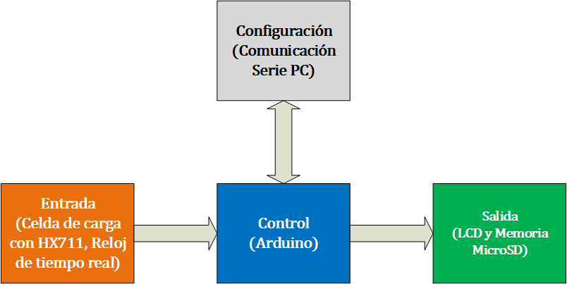

# 
**Monitor de Motor en Arduino**

## Content

1. [Visión general](#Overview)
2. [Hardware utilizado.](#Hardware)
3. [Conexiones.](#Conections)
4. [Código](#Code)

## Visión general 

Este sistema sensa la fuerza de empuje de un motor y, al ingresar manualmente sus revoluciones por minuto, calcula el torque y la potencia del mismo. Los valores obtenidos se despliegan en una pantalla LCD y se guardan en un archivo csv en una tarjeta micro SD para su posterior análisis.

El sistema se encuentra dividido en 4 etapas:
- Etapa de control.
- Etapa de entrada.
- Etapa de salida.
- Etapa de configuración.

  
*Figura 1 – Diagrama por bloques*
<!---The code is divided into three main files:

- project_1.py → main code, whose job is to call the functions inside the other files in order to create the Testbench.  
- Translation.py → it has the ‘Translator’ class, who is in charge of opening the Verilog design file, extracting the information of interest and arranging it inside a dictionary.
- dic_tb.py → it has the ‘Port’ and ‘Module_tb’ classes, among many functions who are in charge of writing the different parts of the Testbench file, namely the head, the signal instantiation and the body. This file also contains a function to convert a given decimal number to a different base.

The Module_TB class has a dependency relationship with the Translator class because it uses the dictionary provided by Translator as input. In addition, Module_TB has a composition relationship with the Port class, since it uses Port type objects. These relationships as well as the composition of the classes are shown in the following image.--->

- - -
## Hardware utilizado 
- [Arduino UNO](#Testbench)
- [Celda de carga DYHW-116](#Port)
- [Amplificador HX711](#Input)
- [Adaptador de tarjeta MicroSD ](#Input)
- [Interfaz De Conversion I2c Lcd ](#Input)
- [Display LCD 20x4 ](#Input)
- - -
## Conexiones 
  
*Figura 2 – Diagrama electrico*
- - -
## Código 
- - -